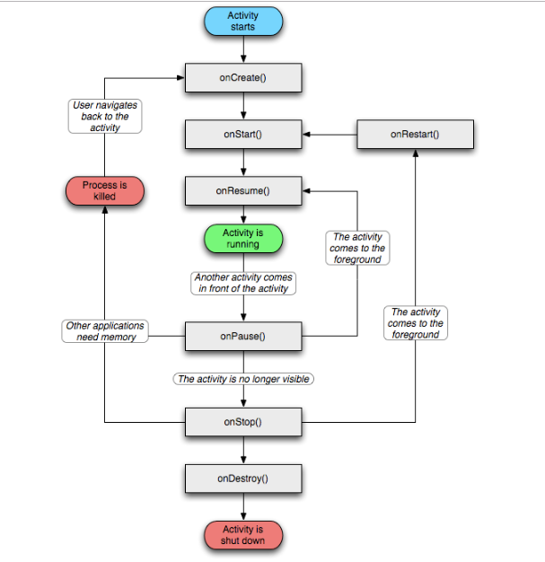

# Activity生命周期
Activity生命周期方法主要有onCreate()、onStart()、onResume()、onPause()、onStop()、onDestroy()和onRestart()等7个方法
## 典型情况下的生命周期
在正常情况下，Activity会经历如下的生命周期：

* onCreate：表示活动正在创建。在这个方法中可以做一些初始化操作，比如setContentView去加载布局资源文件，初始化数据等。
* onStart：表示活动正在启动。活动可见，但是还没出现在前台，无法与用户交互。
* onRestart：表示活动重新启动。当活动由不可见重新变为可见时调用。
* onResume：表示活动可见。有焦点，已经出现在前台，可以与用户交互。
* onPause：表示活动正在停止。
* onStop：表示活动即将停止。
* onDestroy：表示活动即将销毁。可以进行一些回收工作和资源的释放。

**案例**

+ 启动Activity: onCreate()—>onStart()—>onResume()，Activity进入运行状态。
+ Activity退居后台: 当前Activity转到新的Activity界面或按Home键回到主屏： onPause()—>onStop()，进入停滞状态。
+ Activity返回前台: onRestart()—>onStart()—>onResume()，再次回到运行状态。
+ Activity退居后台，且系统内存不足， 系统会杀死这个后台状态的Activity（此时这个Activity引用仍然处在任务栈中，只是这个时候引用指向的对象已经为null），若再次回到这个Activity,则会走onCreate()–>onStart()—>onResume()(将重新走一次Activity的初始化生命周期)
+ 锁屏：onPause()->onStop()
+ 解锁：onStart()->onResume()
---
* 启动一个A Activity，分别执行onCreate()、onStart()、onResume()方法。
* 从A Activity打开B Activity分别执行A onPause()、B onCreate()、B onStart()、B onResume()、A onStop()方法。
* 关闭B Activity，分别执行B onPause()、A onRestart()、A onStart()、A onResume()、B onStop()、B onDestroy()方法。
* 横竖屏切换A Activity，清单文件中不设置android:configChanges属性时，先销毁onPause()、onStop()、onDestroy()再重新创建onCreate()、onStart()、onResume()方法，设置orientation|screenSize（一定要同时出现）属性值时，不走生命周期方法，只会执行onConfigurationChanged()方法。
* Activity之间的切换可以看出onPause()、onStop()这两个方法比较特殊，切换的时候onPause()方法不要加入太多耗时操作否则会影响体验。

**官方的生命周期图**

## 异常情况下的生命周期
有a、b两个Activity，当从a进入b之后一段时间，可能系统会把a回收，这时候按back，执行的不是a的onRestart而是onCreate方法，a被重新创建一次，这是a中的临时数据和状态可能就丢失了。

可以用Activity中的onSaveInstanceState()回调方法保存临时数据和状态，这个方法一定会在活动被回收之前调用。方法中有一个Bundle参数，putString()、putInt()等方法需要传入两个参数，一个键一个值。数据保存之后会在onCreate中恢复，onCreate也有一个Bundle类型的参数。

**onSaveInstanceState (Bundle outState)**

当某个activity变得“容易”被系统销毁时，该activity的onSaveInstanceState就会被执行，除非该activity是被用户主动销毁的，例如当用户按BACK键的时候。

其onSaveInstanceState方法会在什么时候被执行，有这么几种情况：

* 1、当用户按下HOME键时。
这是显而易见的，系统不知道你按下HOME后要运行多少其他的程序，自然也不知道activity A是否会被销毁，故系统会调用onSaveInstanceState，让用户有机会保存某些非永久性的数据。以下几种情况的分析都遵循该原则

* 2、长按HOME键，选择运行其他的程序时。

* 3、按下电源按键（关闭屏幕显示）时。

* 4、从activity A中启动一个新的activity时。

* 5、屏幕方向切换时，例如从竖屏切换到横屏时。**（如果指定android:configchanges属性,activity不会销毁重建，执行onConfigurationChanged(Configuration newConfig)）** 在屏幕切换之前，系统会销毁activity A，在屏幕切换之后系统又会自动地创建activity A，所以onSaveInstanceState一定会被执行

总而言之，onSaveInstanceState的调用遵循一个重要原则，即当系统“未经你许可”时销毁了你的activity，则onSaveInstanceState会被系统调用，这是系统的责任，因为它必须要提供一个机会让你保存你的数据（当然你不保存那就随便你了）。另外，需要注意的几点：

* 1.布局中的每一个View默认实现了onSaveInstanceState()方法，这样的话，这个UI的任何改变都会自动地存储和在activity重新创建的时候自动地恢复。但是这种情况只有在你为这个UI提供了唯一的ID之后才起作用，如果没有提供ID，app将不会存储它的状态。

* 2.由于默认的onSaveInstanceState()方法的实现帮助UI存储它的状态，所以如果你需要覆盖这个方法去存储额外的状态信息，你应该在执行任何代码之前都调用父类的onSaveInstanceState()方法（super.onSaveInstanceState()）。 既然有现成的可用，那么我们到底还要不要自己实现onSaveInstanceState()?这得看情况了，如果你自己的派生类中有变量影响到UI，或你程序的行为，当然就要把这个变量也保存了，那么就需要自己实现，否则就不需要。

* 3.由于onSaveInstanceState()方法调用的不确定性，你应该只使用这个方法去记录activity的瞬间状态（UI的状态）。不应该用这个方法去存储持久化数据。当用户离开这个activity的时候应该在onPause()方法中存储持久化数据（例如应该被存储到数据库中的数据）。

* 4.onSaveInstanceState()如果被调用，这个方法会在onStop()前被触发，但系统并不保证是否在onPause()之前或者之后触发。

**onRestoreInstanceState (Bundle outState)**

至于onRestoreInstanceState方法，需要注意的是，onSaveInstanceState方法和onRestoreInstanceState方法“不一定”是成对的被调用的，（本人注：我昨晚调试时就发现原来不一定成对被调用的！）

onRestoreInstanceState被调用的前提是，activity A“确实”被系统销毁了，而如果仅仅是停留在有这种可能性的情况下，则该方法不会被调用，例如，当正在显示activity A的时候，用户按下HOME键回到主界面，然后用户紧接着又返回到activity A，这种情况下activity A一般不会因为内存的原因被系统销毁，故activity A的onRestoreInstanceState方法不会被执行

另外，onRestoreInstanceState的bundle参数也会传递到onCreate方法中，你也可以选择在onCreate方法中做数据还原。 还有onRestoreInstanceState在onstart之后执行。