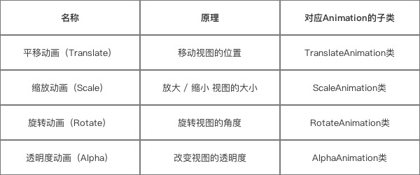

# 补间动画

## 1.作用对象
视图控件（View），如Android的TextView、Button等等
>注：不可作用于View组件的属性，如：颜色、背景等
## 2.原理
通过确定开始的视图样式 & 结束的视图样式、中间动画变化过程由系统补全来确定一个动画
> * 结束的视图样式：平移、缩放、旋转 & 透明度样式
> * 即补间动画的动画效果就是：平移、缩放、旋转 & 透明度动画
## 3.类型
根据不同的动画效果，补间动画分为4种动画：
* 平移动画（Translate）
* 缩放动画（scale）
* 旋转动画（rotate）
* 透明度动画（alpha）
  
**核心类**

## 4.应用场景
### 4.1 标准的动画效果
* 补间动画常用于视图View的一些标准动画效果：平移、旋转、缩放 & 透明度；
* 除了常规的动画使用，补间动画还有一些特殊的应用场景。
### 4.2 特殊的应用场景
* Activity 的切换效果（淡入淡出、左右滑动等）
* Fragement 的切换效果（淡入淡出、左右滑动等）
* 视图组（ViewGroup）中子元素的出场效果（淡入淡出、左右滑动等）
### 5.实战
补间动画的使用方式分为两种：在XML 代码 / Java 代码里设置
* 前者优点：动画描述的可读性更好
* 后者优点：动画效果可动态创建
### 5.1平移动画（Translate）
对应的核心类是：TranslateAnimation类。
#### 5.1.1XML方式实现
**1.在res目录下创建xml文件**
> anim/view_translateanimation.xml

**2.根据动画效果设置动画参数**
**view_translateanimation.xml**  

    <?xml version="1.0" encoding="utf-8"?>
    <translate xmlns:android="http://schemas.android.com/apk/res/android"
        // 以下参数是4种动画效果的公共属性,即都有的属性
        android:duration="3000"
        android:startOffset ="1000"
        android:fillBefore = "true"
        android:fillAfter = "true"
        android:fillEnabled= "true"
        android:repeatMode= "restart"
        android:repeatCount = "1"
        // 以下参数是平移动画特有的属性
        android:fromXDelta="-120"
        android:fromYDelta="-120"
        android:toXDelta="200"
        android:toYDelta="200"

    />
**3.在java代码中使用xml动画**
```
    textView = findViewById(R.id.tv_anim);
    //xml实现平移动画
    Animation translateAnimation = AnimationUtils.loadAnimation(this,R.anim.view_translateanimation);
    textView.setAnimation(translateAnimation);
```
#### 5.1.2Java代码实现
```
Button mButton = (Button) findViewById(R.id.Button);
// 步骤1:创建 需要设置动画的 视图View

Animation translateAnimation = new TranslateAnimation(0，500，0，500);
// 步骤2：创建平移动画的对象：平移动画对应的Animation子类为TranslateAnimation
// 参数分别是：
// 1. fromXDelta ：视图在水平方向x 移动的起始值
// 2. toXDelta ：视图在水平方向x 移动的结束值
// 3. fromYDelta ：视图在竖直方向y 移动的起始值
// 4. toYDelta：视图在竖直方向y 移动的结束值

translateAnimation.setDuration(3000);
// 固定属性的设置都是在其属性前加“set”，如setDuration（）
mButton.startAnimation(translateAnimation);
// 步骤3:播放动画
```
### 5.2缩放动画（Scale）
对应的核心类是：ScaleAnimation类。
#### 5.2.1XML方式实现
**1.在res目录下创建xml文件**
> anim/view_scaleanimation.xml

**2.根据动画效果设置动画参数**
**view_scaleanimation.xml**  

    <?xml version="1.0" encoding="utf-8"?>
    <scale xmlns:android="http://schemas.android.com/apk/res/android"
        // 以下参数是4种动画效果的公共属性,即都有的属性
        android:duration="3000"
        android:startOffset ="1000"
        android:fillBefore = "true"
        android:fillAfter = "true"
        android:fillEnabled= "true"
        android:repeatMode= "restart"
        android:repeatCount = "1"
        // 以下参数是缩放动画特有的属性
        android:fromXScale="0.0" 
        // 动画在水平方向X的起始缩放倍数
        // 0.0表示收缩到没有；1.0表示正常无伸缩
        // 值小于1.0表示收缩；值大于1.0表示放大

        android:toXScale="2"  //动画在水平方向X的结束缩放倍数

        android:fromYScale="0.0" //动画开始前在竖直方向Y的起始缩放倍数
        android:toYScale="2" //动画在竖直方向Y的结束缩放倍数

        android:pivotX="50%" // 缩放轴点的x坐标
        android:pivotY="50%" // 缩放轴点的y坐标

    />
**3.在java代码中使用xml动画**
```
    textView = findViewById(R.id.tv_anim);
    //xml实现平移动画
    Animation scaleteAnimation = AnimationUtils.loadAnimation(this,R.anim.view_scaleanimation);
    textView.setAnimation(scaleteAnimation);
```
#### 5.2.2Java代码实现
```
    Button mButton = (Button) findViewById(R.id.Button);
    // 步骤1:创建 需要设置动画的 视图View

    Animation rotateAnimation = new ScaleAnimation(0,2,0,2,Animation.RELATIVE_TO_SELF,0.5f,Animation.RELATIVE_TO_SELF,0.5f);
    // 步骤2：创建缩放动画的对象 & 设置动画效果：缩放动画对应的Animation子类为RotateAnimation
    // 参数说明:
    // 1. fromX ：动画在水平方向X的结束缩放倍数
    // 2. toX ：动画在水平方向X的结束缩放倍数
    // 3. fromY ：动画开始前在竖直方向Y的起始缩放倍数
    // 4. toY：动画在竖直方向Y的结束缩放倍数
    // 5. pivotXType:缩放轴点的x坐标的模式
    // 6. pivotXValue:缩放轴点x坐标的相对值
    // 7. pivotYType:缩放轴点的y坐标的模式
    // 8. pivotYValue:缩放轴点y坐标的相对值

    // pivotXType = Animation.ABSOLUTE:缩放轴点的x坐标 =  View左上角的原点 在x方向 加上 pivotXValue数值的点(y方向同理)
    // pivotXType = Animation.RELATIVE_TO_SELF:缩放轴点的x坐标 = View左上角的原点 在x方向 加上 自身宽度乘上pivotXValue数值的值(y方向同理)
    // pivotXType = Animation.RELATIVE_TO_PARENT:缩放轴点的x坐标 = View左上角的原点 在x方向 加上 父控件宽度乘上pivotXValue数值的值 (y方向同理)

    scaleAnimation.setDuration(3000);
    // 固定属性的设置都是在其属性前加“set”，如setDuration（）

    mButton.startAnimation(scaleAnimation);
    // 步骤3：播放动画
```
### 5.3旋转动画（Translate）
### 5.4透明度动画（Translate）

### 总结
