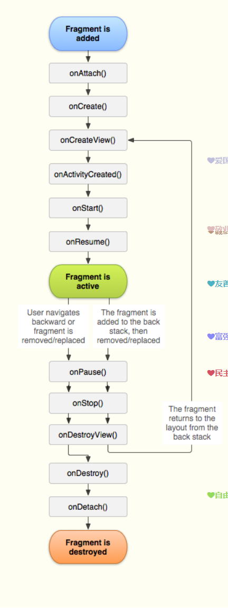
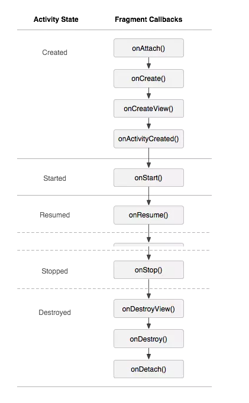

# Fragment生命周期

Fragment的生命周期方法主要有onAttach()、onCreate()、onCreateView()、onActivityCreated()、onstart()、onResume()、onPause()、onStop()、onDestroyView()、onDestroy()、onDetach()等11个方法。

* 切换到该Fragment，分别执行onAttach()、onCreate()、onCreateView()、onActivityCreated()、onstart()、onResume()方法。
* 锁屏，分别执行onPause()、onStop()方法。
* 亮屏，分别执行onstart()、onResume()方法。
* 覆盖，切换到其他Fragment，分别执行onPause()、onStop()、onDestroyView()方法。
* 从其他Fragment回到之前Fragment，分别执行onCreateView()、onActivityCreated()、onstart()、onResume()方法。

**Fragement的生命周期**

**Fragment的生命周期和Activity的生命周期作对比**

**Fragment的生命周期和Activity如何的一个关系**
