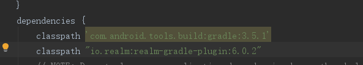
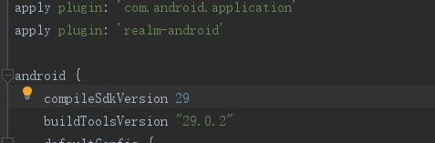
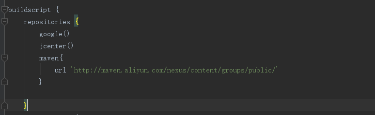

[TOC]
# Realm
参考 [https://realm.io/cn/docs/java/latest/](https://realm.io/cn/docs/java/latest/)
## 一、Realm简介
**Github链接: [https://github.com/realm/realm-java](https://github.com/realm/realm-java)**
### 1.什么是Realm
Realm 是一个手机数据库，是用来替代 SQlite 的解决方案，比 SQlite 更轻量级，速度更快，因为它有一套自己的数据库搜索引擎，并且还具有很多现代数据库的优点，支持 JSON，流式 API 调用，数据变更通知，自动数据同步，简单身份验证，访问控制，事件处理，最重要的是跨平台，目前已经支持 Java、Swift、Object - C、React - Native 等多种实现。
Realm 本质上是一个嵌入式数据库，他并不是基于SQLite所构建的。它拥有自己的数据库存储引擎，可以高效且快速地完成数据库的构建操作。和SQLite不同，它允许你在持久层直接和数据对象工作。在它之上是一个函数式风格的查询api，众多的努力让它比传统的SQLite 操作更快 。
### 2.Realm优势
* **易用**
Ream 不是在SQLite基础上的ORM，它有自己的数据查询引擎。并且十分容易使用。
* **快速**
由于它是完全重新开始开发的数据库实现，所以它比任何的ORM速度都快很多，甚至比SLite速度都要快。
* **跨平台**
Realm 支持 iOS & OS X (Objective‑C & Swift) & Android。我们可以在这些平台上共享Realm数据库文件，并且上层逻辑可以不用任何改动的情况下实现移植。
* **高级**
Ream支持加密，格式化查询，易于移植，支持JSON，流式api，数据变更通知等高级特性
* **可视化**
Realm 还提供了一个轻量级的数据库查看工具，在Mac Appstore 可以下载“Realm Browser”这个工具，开发者可以查看数据库当中的内容，执行简单的插入和删除数据的操作。（windows上还不清楚）
## 二、Realm使用
### 1. 数据模型
*  **一个模型表示一张表，模型中的字段表示表中的列**
* **模型需要继承RealmObject类**
* **模式实时、字段更新**
### 2. 事务
* **所有会使数据发生变化的操作都必须在事务中进行**
* **事务分为同步事务和异步事务两种**
* **两种事务共有三种写法**

#### 手动开启同步事务
```
        //获取Realm实例
        Realm realm = Realm.getDefaultInstance();
        //开启事务
        realm.beginTransaction();
        //创建被Realm管理的实例对象
        User user = realm.createObject(User.class);
        //更改数据，此时数据只更新在缓存中
        user.setPhone("141574");
        //提交事务，数据写入数据库
        realm.commitTransaction();
        //事务取消，取消事务后，所有对数据的修改都会被取消
        realm.cancelTransaction();
```
#### 同步事务执行块
```
        /**
         * 自动开启事务和提交事务
         * 出错时自动回滚事务
         */
        realm.executeTransaction(new Realm.Transaction() {
            @Override
            public void execute(Realm realm) {
                User u = realm.createObject(User.class);
                u.setPassword("21534354");
            }
        });
```
#### 异步事务执行块
```
        RealmAsyncTask realmAsyncTask = realm.executeTransactionAsync(new Realm.Transaction() {
            @Override
            public void execute(Realm realm) {
                User u = realm.createObject(User.class);
                u.setPassword("21534354");
            }
        }, new Realm.Transaction.OnSuccess() {
            @Override
            public void onSuccess() {
                Log.i("Realm","事务执行成功的回调");
            }
        }, new Realm.Transaction.OnError() {
            @Override
            public void onError(Throwable error) {
                Log.i("Realm","事务执行失败的回调");
            }
        });

        //退出Activity或者Fragment时，可以使用RealmAsyncTask对象取消异步事务
        if(realmAsyncTask != null && realmAsyncTask.isCancelled()){
            realmAsyncTask.cancel();
        }

```

### 1.Realm基本配置
* 1.在project下的build.gradle文件中添加

```
classpath "io.realm:realm-gradle-plugin:6.0.2"
```



* 2.在app下的build.gradle文件中添加
```
apply plugin: 'realm-android'
```


* 3.在project下的build.gradle文件中添加阿里云镜像
```
maven{
    url 'http://maven.aliyun.com/nexus/content/groups/public/'
}
```


### 2.创建一个Realm数据库
**创建一个持久化Realm数据库**
和SQLite数据库类似，每个Realm对应一个数据库文件。但是它的数据库后缀不是.db而是.realm
可以调用Realm.getInstance方法来创建一个Realm数据库：
```        
        //获取Realm实例
        Realm realm = Realm.getDefaultInstance();
```
注意这里只是传入一个context，并没有传入数据库文件的文件名，这时候会创建一个叫做 default.realm的Realm文件，一般来说，这个文件位于/data/data//files/，可以通过realm.getPath()来获得该Realm的绝对路径。
需要注意的是Realm的实例是线程单例化的，也就是说，在同一个线程内多次调用静态方法获得针对同路径的Realm，会返回同一个Realm实例。

当然，我们还可以使用RealmConfiguration来配置Realm
```
RealmConfiguration config = new RealmConfiguration.Builder() 
            .name("myrealm.realm") //文件名
            .schemaVersion(0) //版本号
            .build();
Realm realm = Realm.getInstance(config);

```
**RealmConfiguration支持的方法**：

* Builder.name : 指定数据库的名称。如不指定默认名为default。
* Builder.schemaVersion : 指定数据库的版本号。
* Builder.encryptionKey : 指定数据库的密钥。
* Builder.migration : 指定迁移操作的迁移类。
* Builder.deleteRealmIfMigrationNeeded : 声明版本冲突时自动删除原数据库。
* Builder.inMemory : 声明数据库只在内存中持久化。
* build : 完成配置构建。

**关闭Realm实例**
Realm 实现了 Closeable 接口以便与释放 native 内存和文件描述符，请务必在使用完毕后关闭 Realm 实例。
Realm 实例是基于**引用计数**, 也就是说假设您在同一个线程中调用了 getInstance() 两次，您需要同样调用 close() 两次以关闭该实例。

### 3. Samples
#### 3.1创建model
**支持的属性**
boolean, byte, short,int,long,float, double,String, Date 和，byte[], RealmObject, RealmList<? extends RealmObject>
还支持Boolean, Byte, Short, Integer, Long, Float 和 Double
**Tip**：整数类型 short、int 和 long 都被映射到 Realm 内的相同类型（实际上为 long ）

**常用注解**
（1）@PrimaryKey——表示该字段是主键（注释@PrimaryKey隐式地设置注释@Index）。
（2）@Required——表示该字段非空。
只能用于Boolean, Byte, Short, Integer, Long, Float, Double, String, byte[] 和 Date
（3）@Required修饰会导致编译失败。
提示：基本数据类型不需要使用注解 @Required，因为他们本身就不可为空。
（4）@Ignore——表示忽略该字段
被添加@Ignore标签后，存储数据时会忽略该字段。
（5）@Index——添加搜索索引
支持索引：String，byte，short，int，long，boolean和Date字段。

注意：如果你创建Model并运行过，然后修改了Model。那么就需要升级数据库，否则会抛异常。升级方式后面会提到

---
**继承RealmObject**
创建User类继承RealmObject
```
package org.gpnu.cloudmusic.model;

import io.realm.RealmObject;

//相当于sqllite的表
//字段表示表中的列
public class User extends RealmObject {
    private String phone;
    private String password;

    public User() {
    }

    public User(String phone, String password) {
        this.phone = phone;
        this.password = password;
    }

    public String getPhone() {
        return phone;
    }

    public void setPhone(String phone) {
        this.phone = phone;
    }

    public String getPassword() {
        return password;
    }

    public void setPassword(String password) {
        this.password = password;
    }
}
```
**实现RealmModel接口**
或者创建User类实现RealmModel接口并添加 @RealmClass修饰符来声明
```
import io.realm.RealmModel;
import io.realm.RealmObject;
import io.realm.annotations.RealmClass;

@RealmClass
public class User implements RealmModel {
    private String phone;
    private String password;

    public User() {
    }

    public User(String phone, String password) {
        this.phone = phone;
        this.password = password;
    }

    public String getPhone() {
        return phone;
    }

    public void setPhone(String phone) {
        this.phone = phone;
    }

    public String getPassword() {
        return password;
    }

    public void setPassword(String password) {
        this.password = password;
    }
}
```

#### 3.2添加数据（增）
```
        realm.beginTransaction();

        //方法一
/*        User user = realm.createObject(User.class);
        user.setPhone("456454");*/

        //方法二
        User user = new User();
        u.setPhone("125456484");
        realm.copyToRealm(user);    //user为普通对象，需要转化为realm对象

        realm.commitTransaction();
```
#### 3.3删除数据（删）
```
    // obtain the results of a query
    final RealmResults<Dog> results = realm.where(Dog.class).findAll();

    // All changes to data must happen in a transaction
    realm.executeTransaction(new Realm.Transaction() {
        @Override
        public void execute(Realm realm) {
            // remove single match
            results.deleteFirstFromRealm();
            results.deleteLastFromRealm();

            // remove a single object
            Dog dog = results.get(5);
            dog.deleteFromRealm();

            // Delete all matches
            results.deleteAllFromRealm();
        }
    });
```
#### 3.4查询数据（查）
Realm 中的所有读取（包括查询）操作都是延迟执行的，且数据绝不会被拷贝。
当查询没有任何匹配时，返回的 RealmResults 对象将不会为 null，取而代之的是它的 size() 方法将返回 0。
**1. 查询条件**

**所有数据类型均支持如下查询条件**

* equalTo()
* notEqualTo()

in() 可以用来匹配一组数据中的某个成员

**数值型字段，包括 Date 还支持如下这些查询条件**

* between()
* greaterThan()
* lessThan()
* greaterThanOrEqualTo()
* lessThanOrEqualTo()

**字符串类型字段额外支持如下查询条件**

* contains()
* beginsWith()
* endsWith()
* like()
* isNull() & isNotNull()
* isEmpty() & isNotEmpty()

你还可以针对这四种字符串查询条件设置大小写敏感参数。Case.INSENSITIVE 会忽略大小写，而 Case.SENSITIVE 只匹配大小写完全相同的字符串。默认参数是 Case.SENSITIVE。

**2. 逻辑运算符**
每个查询条件都会被被隐式地被逻辑和（&）组合在一起，而逻辑或（or）需要显式地去执行 or()。
你也可以将查询条件组合在一起，使用 beginGroup()（相当于左括号）和 endGroup()（相当于右括号）：
```
RealmResults<User> r = realm.where(User.class)
                           .not()
                           .beginGroup()
                                .equalTo("name", "Peter")
                                .or()
                                .contains("name", "Jo")
                            .endGroup()
                            .findAll();

RealmResults<User> r = realm.where(User.class)
                           .not()
                           .in("name", new String[]{"Peter", "Jo"})
                           .findAll();
```
**3. 排序**
当你执行完查询获得结果后，可以对它进行排序：
```
RealmResults<MusicItemBean> qury2 =
        musicRealmDB.where(Country.class)
                .findAllSorted("title", true);
                //true表示升序排序，false表示降序排序。


RealmResults<User> result = realm.where(User.class).findAll();
result = result.sort("age"); // Sort ascending
result = result.sort("age", Sort.DESCENDING);
```
排序默认为升序。你可以使用 Sort.DESCENDING 来做降序排序。你还可以同时针对不同字段进行排序。
**4. 唯一值**
你可以使用 distinct() 来查找唯一值。例如查找所有不同的姓名：
```
RealmResults<Person> unique = realm.where(Person.class).distinct("name");
```
只有数值型和字符串字段支持该查询条件。和排序类似，你也可以针对多个字段使用该查询条件。
**5. 聚合**
```
RealmResults<User> results = realm.where(User.class).findAll();
long   sum     = results.sum("age").longValue();
long   min     = results.min("age").longValue();
long   max     = results.max("age").longValue();
double average = results.average("age");
long   matches = results.size();
```
**6. 迭代**
```
RealmResults<User> results = realm.where(User.class).findAll();
for (User u : results) {
    // ... do something with the object ...
}

RealmResults<User> results = realm.where(User.class).findAll();
for (int i = 0; i < results.size(); i++) {
    User u = results.get(i);
    // ... do something with the object ...
}
```
**7. 异步查询**
```
RealmResults<User> result = realm.where(User.class)
                              .equalTo("name", "John")
                              .or()
                              .equalTo("name", "Peter")
                              .findAllAsync();
```
这里的调用并不会阻塞，而是立即返回一个 RealmResults<User>。这很类似于标准 Java 中 Future 的概念。查询将会在后台线程中被执行，当其完成时，之前返回的 RealmResults 实例会被更新。

如果你希望当查询完成、RealmResults 被更新时获得通知，你可以注册一个 RealmChangeListener。这个监听器会在 RealmResults 被更新时被调用（通常是在事务被提交后）。

**注册回调**
```
private RealmChangeListener callback = new RealmChangeListener<RealmResults<User>>() {
    @Override
    public void onChange(RealmResults<User> results) {
        // called once the query complete and on every update
    }
};

public void onStart() {
    RealmResults<User> result = realm.where(User.class).findAllAsync();
    result.addChangeListener(callback);
}
```
请在退出 Activity 或者 Fragment 时移除监听器的注册以避免内存泄漏。
```
public void onStop () {
    result.removeChangeListener(callback); // remove a particular listener
    // or
    result.removeChangeListeners(); // remove all registered listeners
}
```
检查查询是否完成
```
RealmResults<User> result = realm.where(User.class).findAllAsync();
if (result.isLoaded()) {
  // Results are now available
}
```
同步查询返回的 RealmResults 实例的 isLoaded 方法会永远返回 true。


#### 3.4修改数据（改）
```
Realm  mRealm=Realm.getDefaultInstance();

Dog dog = mRealm.where(Dog.class).equalTo("id", id).findFirst();
mRealm.beginTransaction();
dog.setName(newName);
mRealm.commitTransaction();
```

### 4.Realms
Realm(s) 是我们对数据库的称谓：它包含多个不同的对象，并对应磁盘中的一个文件。在使用之前，需要对 Realm 库进行初始化操作：
```
public class MyApplication extends Application {
  @Override
  public void onCreate() {
    super.onCreate();
    Realm.init(this);
  }
}
```
### 5. 多表关系
多对多 关系
```
public class Contact extends RealmObject {
    private RealmList<Email> emails;
    // Other fields…
}
```
RealmList 是 Realm 模型对象的容器，其行为与 Java 的普通 List 近乎一样。
同一个 Realm 模型对象可以存在于多个 RealmList 中。
同一个 Realm 模型对象可以在同一个 RealmList 中存在多次。
```
realm.beginTransaction();
Contact contact = realm.createObject(Contact.class);
contact.setName("John Doe");

Email email1 = realm.createObject(Email.class);
email1.setAddress("john@example.com");
email1.setActive(true);
contact.getEmails().add(email1);

Email email2 = realm.createObject(Email.class);
email2.setNumber("jd@example.com");
email2.setActive(false);
contact.getEmails().add(email2);

realm.commitTransaction();
```
**关联查询**
```
public class Person extends RealmObject {
  private String id;
  private String name;
  private RealmList<Dog> dogs;
  // getters and setters
}

public class Dog extends RealmObject {
  private String id;
  private String name;
  private String color;
  // getters and setters
}

// r1 => [u1,u2]
realmresults<user> r1 = realm.where(user.class)
                             .equalto("dogs.name", "fluffy")
                             .equalto("dogs.color", "brown")
                             .findall();

// r2 => [u2]
realmresults<user> r2 = realm.where(user.class)
                             .equalto("dogs.name", "fluffy")
                             .findall()
                             .where()
                             .equalto("dogs.color", "brown")
                             .findall();
                             .where()
                             .equalto("dogs.color", "yellow")
                             .findall();
```
### 6. JSON
你可以直接将 JSON 对象添加到 Realm 中，这些 JSON 对象可以是一个 String、一个 JSONObject 或者是一个 InputStream。Realm 会忽略 JSON 中存在但未定义在 Realm 模型类里的字段。单独对象可以通过 Realm.createObjectFromJson() 添加。对象列表可以通过 Realm.createAllFromJson() 添加。
```
// A RealmObject that represents a city
public class City extends RealmObject {
    private String city;
    private int id;
    // getters and setters left out ...
}

// Insert from a string
realm.executeTransaction(new Realm.Transaction() {
    @Override
    public void execute(Realm realm) {
        realm.createObjectFromJson(City.class, "{ city: \"Copenhagen\", id: 1 }");
    }
});

// Insert multiple items using an InputStream
realm.executeTransaction(new Realm.Transaction() {
    @Override
    public void execute(Realm realm) {
        try {
            InputStream is = new FileInputStream(new File("path_to_file"));
            realm.createAllFromJson(City.class, is);
        } catch (IOException e) {
            throw new RuntimeException();
        }
    }
});
```
Realm 解析 JSON 时遵循如下规则：

使用包含空值（null）的 JSON 创建对象：
对于非必须（可为空值的属性），设置其值为 null；
对于必须（不可为空值的属性），抛出异常；
使用包含空值（null）的 JSON 更新对象：
对于非必须（可为空值的属性），设置其值为 null；
对于必须（不可为空值的属性），抛出异常；
使用不包含对应属性的 JSON：
该属性保持不变

### 7. 版本升级
当数据结构发生变化是，需要升级数据库。对于Realm来说，数据库升级就是迁移操作，把原来的数据库迁移到新结构的数据库。

User版本：version 0
```
String name;
int    age;
```
User版本：version 1
```
@Required
String    id;
String name;
```
创建迁移类CustomMigration，需要实现RealmMigration接口。执行版本升级时的处理：
```
    /**
     * 升级数据库
     */
    class CustomMigration implements RealmMigration {
        @Override
        public void migrate(DynamicRealm realm, long oldVersion, long newVersion) {
            RealmSchema schema = realm.getSchema();
            if (oldVersion == 0 && newVersion == 1) {
                RealmObjectSchema personSchema = schema.get("User");
                //新增@Required的id
                personSchema
                        .addField("id", String.class, FieldAttribute.REQUIRED)
                        .transform(new RealmObjectSchema.Function() {
                            @Override
                            public void apply(DynamicReal
mObject obj) {
                                obj.set("id", "1");//为id设置值
                            }
                        })
                        .removeField("age");//移除age属性
                oldVersion++;
            }
        }
    }
```
使用Builder.migration升级数据库，将版本号改为1（原版本号：0）。当Realm发现新旧版本号不一致时，会自动使用该迁移类完成迁移操作。
```
RealmConfiguration config = new RealmConfiguration.Builder() 
            .name("myrealm.realm") //文件名
            .schemaVersion(1) 
            .migration(new CustomMigration())//升级数据库
            .build();
```
### 8. 加密
```
byte[] key = new byte[64];
new SecureRandom().nextBytes(key);
RealmConfiguration config = new RealmConfiguration.Builder()
  .encryptionKey(key)
  .build();
Realm realm = Realm.getInstance(config);

```