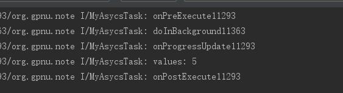
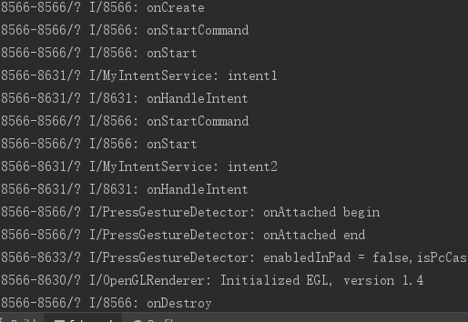

[TOC]
# Android多线程技术
**并发和并行**
	并发：时间段内同时执行 
	并行：时间点上同时执行
**进程和线程**

**多进程间的通信**

* 文件映射：本地之间
* 共享内存：本地之间
* 匿名管道：本地之间
* 命名管道：跨服务器
* 邮件槽：一对多的传输数据，通常通过网络向一台Windows机器传输
* 剪切板：本地之间
* socket：跨服务器
* 
**多线程间的通信**

* 全局变量
* 自定义消息响应

**线程同步机制**

* 临界区：不可以跨进程，忘记解锁会无限等待，要么存在要么没有，多线程访问独占性共享资源
* 互斥量：可以跨进程，忘记解锁会自动释放，要么存在要么没有
* 事件：又叫线程触发器，不可以跨进程，要么存在要么没有，一个线程来唤醒另一个线程（包括自动和人工两种方式）
* 信号量：可以跨进程，始终代表可用资源数量，当资源数为o时，线程阻塞，允许多个线程同时访问一个共享资源

1、临界区：通过对多线程的串行化来访问公共资源或一段代码，速度快，适合控制数据访问。在任意时刻只允许一个线程对共享资源进行访问，如果有多个线程试图访问公共资源，那么在有一个线程进入后，其他试图访问公共资源的线程将被挂起，并一直等到进入临界区的线程离开，临界区在被释放后，其他线程才可以抢占。  
2、互斥量：采用互斥对象机制。 只有拥有互斥对象的线程才有访问公共资源的权限，因为互斥对象只有一个，所以能保证公共资源不会同时被多个线程访问。互斥不仅能实现同一应用程序的公共资源安全共享，还能实现不同应用程序的公共资源安全共享  
3、信号量：它允许多个线程在同一时刻访问同一资源，但是需要限制在同一时刻访问此资源的最大线程数目  
4、事 件： 通过通知操作的方式来保持线程的同步，还可以方便实现对多个线程的优先级比较的操作

* **临界区（Critical Section）**：适合一个进程内的多线程访问公共区域或代码段时使用  
* **互斥量 (Mutex)**：适合不同进程内多线程访问公共区域或代码段时使用，与临界区相似。  
* **事件（Event）**：通过线程间触发事件实现同步互斥  
* **信号量（Semaphore）**：与临界区和互斥量不同，可以实现多个线程同时访问公共区域数据，原理与操作系统中PV操作类似，先设置一个访问公共区域的线程最大连接数，每有一个线程访问共享区资源数就减一，直到资源数小于等于零。

临界区和互斥器都有“线程所有权”的概念，所以它们是不能用来实现线程间的同步的，只能用来实现互斥。原因是由于创建临界区或互斥器的线程可以不用等待LeaveCriticalSection(),SetEvent()就可以无条件进入保护的程序段，因为它拥有这个权利。另外，互斥器可以很好的处理”遗弃“操作。若线程在未释放对向象的时候就意外终止的，其它线程可以等待到一个WAIT_ABANDONED_0。但是事件和信号量都不能做到。  
事件和信号量都可以实现线程和进程间的互斥和同步。就使用效率来说，临界区的效率是最高的，因为它不是内核对象，而其它的三个都是核心对象，要借助操作系统来实现，效率相对来说就比较低。但如果要跨进程使用还是要用到互斥器、事件对象和信号量。

---
## Android线程
**a. 主线程（UI线程）**

* 定义：Android系统在程序启动时会自动启动一条主线程
* 作用：处理四大组件与用户进行交互的事情（如UI、界面交互相关）
* 注：因为用户随时会与界面发生交互，因此主线程任何时候都必须保持很高的响应速度，所以主线程不允许进行耗时操作，否则会出现ANR

**b. 子线程（工作线程）**

* 定义：手动创建的线程
* 作用：耗时的操作（网络请求、I/O操作等）

---

## 1. 创建 Java线程四种方法

### 1.1 继承Thread类
只能单继承
```
	Thread thread = new MyThread("MyThread");
    //线程启动
	thread.start();
```
### 1.2 实现Runnable接口
```
	Thread thread = new Thread(new MyRunnable(),"MyRunnable");
    //线程启动
	thread.start();
```
### 1.3 使用Callable和Future创建线程

有返回值
```
	FutureTask task = new FutureTask(new MyCallable());
    Thread thread = new Thread(task,"MyCallable");
```
### 1.4 线程池创建

```
	ExecutorService executorService = Executors.newFixedThreadPool(10);
    executorService.execute(new MyRunnable());
```

## 2. Handler

### 2.1 定义

一套 Android 消息传递机制

### 2.2 作用

在多线程的应用场景中，将工作线程中需更新UI的操作信息 传递到 UI主线程，从而实现 工作线程对UI的更新处理，最终实现异步消息的处理

### 2.3 意义

* 问：为什么要用 Handler消息传递机制
* 答：多个线程并发更新UI的同时 保证线程安全


### 2.4 相关概念


### 2.5 使用方式

>Handler的使用方式 因发送消息到消息队列的方式不同而不同
>共分为2种：使用Handler.sendMessage（）、使用Handler.post（）

## 3. HandlerThread


### 3.1 定义

一个Android 已封装好的轻量级异步通信类

### 3.2 作用

* 实现多线程
在工作线程中执行任务，如 耗时任务
* 异步通信、消息传递
实现工作线程 & 主线程（UI线程）之间的通信，即：将工作线程的执行结果传递给主线程，从而在主线程中执行相关的UI操作

### 3.3 优点

方便实现异步通信，即不需使用 “任务线程（如继承Thread类） + Handler”的复杂组合

> 实际上，HandlerThread本质上是通过继承Thread类和封装Handler类的使用，从而使得创建新线程和与其他线程进行通信变得更加方便易用


### 3.4 原理

内部原理 = Thread类 +  Handler类机制，即：
>通过继承Thread类，快速地创建1个带有Looper对象的新工作线程
>通过封装Handler类，快速创建Handler & 与其他线程进行通信

### 3.5 使用步骤

```
// 步骤1：创建HandlerThread实例对象
// 传入参数 = 线程名字，作用 = 标记该线程
   HandlerThread mHandlerThread = new HandlerThread("handlerThread");

// 步骤2：启动线程
   mHandlerThread.start();

// 步骤3：创建工作线程Handler & 复写handleMessage（）
// 作用：关联HandlerThread的Looper对象、实现消息处理操作 & 与其他线程进行通信
// 注：消息处理操作（HandlerMessage（））的执行线程 = mHandlerThread所创建的工作线程中执行
  Handler workHandler = new Handler( handlerThread.getLooper() ) {
            @Override
            public boolean handleMessage(Message msg) {
                ...//消息处理
                return true;
            }
        });

// 步骤4：使用工作线程Handler向工作线程的消息队列发送消息
// 在工作线程中，当消息循环时取出对应消息 & 在工作线程执行相关操作
  // a. 定义要发送的消息
  Message msg = Message.obtain();
  msg.what = 2; //消息的标识
  msg.obj = "B"; // 消息的存放
  // b. 通过Handler发送消息到其绑定的消息队列
  workHandler.sendMessage(msg);

// 步骤5：结束线程，即停止线程的消息循环
  mHandlerThread.quit();
```

## 4. AsyncTask

AsyncTask的实现原理 = 线程池 + Handler
>线程池用于线程调度、复用 & 执行任务；Handler 用于异步通信

AsyncTask类属于抽象类，即使用时需 实现子类
```
public abstract class AsyncTask<Params, Progress, Result> { 
 ... 
}

// 类中参数为3种泛型类型
// 整体作用：控制AsyncTask子类执行线程任务时各个阶段的返回类型
// 具体说明：
    // a. Params：开始异步任务执行时传入的参数类型，对应excute（）中传递的参数
    // b. Progress：异步任务执行过程中，返回下载进度值的类型
    // c. Result：异步任务执行完成后，返回的结果类型，与doInBackground()的返回值类型保持一致
// 注：
    // a. 使用时并不是所有类型都被使用
    // b. 若无被使用，可用java.lang.Void类型代替
    // c. 若有不同业务，需额外再写1个AsyncTask的子类
}
```

**使用建议**

* 在Activity 或 Fragment中使用 AsyncTask时，最好在Activity 或 Fragment的onDestory（）调用 cancel(boolean)；
* 若AsyncTask被声明为Activity的非静态内部类，当Activity需销毁时，会因AsyncTask保留对Activity的引用 而导致Activity无法被回收，最终引起内存泄露。
* AsyncTask应被声明为Activity的静态内部类


### 4.1 定义
AsyncTask就是一个Handler和线程池的封装，线程池用来异步处理后台任务，handler用来发送消息进行UI方面的交互。
### 4.2 作用

* **实现多线程**
在工作线程中执行任务，如 耗时任务
* **异步通信、消息传递**
实现工作线程 & 主线程（UI线程）之间的通信，即：将工作线程的执行结果传递给主线程，从而在主线程中执行相关的UI操作

### 4.3 优点

* **方便实现异步通信**
不需使用 “任务线程（如继承Thread类） + Handler”的复杂组合
* **节省资源**
采用线程池的缓存线程 + 复用线程，避免了频繁创建 & 销毁线程所带来的系统资源开销

### 4.4 核心方法


### 4.5 使用步骤

* 步骤1：创建 AsyncTask 子类 & 根据需求实现核心方法
* 步骤2：创建 AsyncTask子类的实例对象（即 任务实例）
* 步骤3：手动调用execute(（）从而执行异步线程任务

### 4.6 Demo

**1. 创建 AsyncTask 子类 & 根据需求实现核心方法**
```
import android.os.AsyncTask;
import android.os.Process;
import android.util.Log;

public class MyAsycsTask extends AsyncTask<Integer,Integer,Void> {

    @Override
    protected void onPreExecute() {
        Log.i("MyAsycsTask","onPreExecute" + Process.myTid());
        super.onPreExecute();
    }

    @Override
    protected Void doInBackground(Integer... integers) {
        Log.i("MyAsycsTask","doInBackground" + Process.myTid());
        publishProgress(5);
        return null;
    }

    @Override
    protected void onProgressUpdate(Integer... values) {
        Log.i("MyAsycsTask","onProgressUpdate" + Process.myTid());
        Log.i("MyAsycsTask","values: " + values[0]);
        super.onProgressUpdate(values);
    }

    @Override
    protected void onPostExecute(Void aVoid) {
        Log.i("MyAsycsTask","onPostExecute" + Process.myTid());
        super.onPostExecute(aVoid);
    }

}

```

**2. 创建 AsyncTask子类的实例对象（即 任务实例）**
```
        MyAsycsTask task = new MyAsycsTask();
        task.execute(6);
```

**运行结果**


## 5. IntentService
### 5.1 定义
Android里的一个封装类，继承四大组件之一的Service
### 5.2 作用
处理异步请求 & 实现多线程
### 5.3 优点
* （1）它创建一个独立的工作线程来一个一个处理所有Intent。
* （2）创建了一个工作队列，来逐个发送Intent给onHandleIntent()
* （3）不需要主动调用stopSelf()来结束服务，因为源码里面自己实现了自动关闭。
* （4）默认实现了onBind()返回的null。
* （5）默认实现了onStartCommand()方法，目的是将intent插入到工作队列。

总结：（使用IntentService的好处）首先，省去了手动开线程的麻烦；第二，不用手动停止Service；第三，由于设计了工作队列，可以启动多次startService()，但是只有一个Service实例和一个工作线程。按顺序一个一个执行。

### 5.4 原理

IntentService是继承Service的一个抽象类，它在onCreate()方法中创建了一个HandlerThread，并启动该线程。
HandlerThread是带有自己消息队列和Looper的线程，根据HandlerThread的looper创建一个Handler，这样IntentService的ServiceHandler的HandleMessage()方法就运行在子线程中。
HandleMessage中调用了onHandleIntent()方法，它是一个抽象方法，继承IntentService类需要实现该方法，把耗时操作放在onHandleIntent()方法中，等耗时操作运行完成后，会调用stopSelf()方法，服务会调用onDestory()方法消毁自己。
如果onHandleIntent()方法中的耗时操作未运行完前就调用了stopSelf()方法，服务调用onDestory()方法，但耗时操作会继续运行，直至运行完毕。如果同时多次启动IntentService，任务会放在一个队列中，onCreate()和onDestory()方法都只会运行一次。

### 5.5 使用场景
线程任务 需 按顺序、在后台执行
>最常见的场景：离线下载
>不符合多个数据同时请求的场景：所有的任务都在同一个Thread looper里执行
### 5.6 使用步骤
步骤1：定义 IntentService的子类，需复写onHandleIntent()方法
步骤2：在Manifest.xml中注册服务
步骤3：在Activity中开启Service服务
### 5.7 Demo
**1. 定义 IntentService的子类，需复写onHandleIntent()方法**

```
import android.app.IntentService;
import android.content.Intent;
import android.os.Process;
import android.util.Log;

import androidx.annotation.Nullable;

public class MyIntentService extends IntentService {

    public MyIntentService() {
        super("MyIntentService");
    }

    @Override
    public void onCreate() {
        Log.i(Process.myTid()+"","onCreate");
        super.onCreate();
    }

    @Override
    public void onStart(@Nullable Intent intent, int startId) {
        Log.i(Process.myTid()+"","onStart");
        super.onStart(intent, startId);
    }

    @Override
    public int onStartCommand(@Nullable Intent intent, int flags, int startId) {
        Log.i(Process.myTid()+"","onStartCommand");
        return super.onStartCommand(intent, flags, startId);
    }

    @Override
    protected void onHandleIntent(@Nullable Intent intent) {
        int tag = intent.getIntExtra("tag", 0);
        switch (tag) {
            case 1:
                Log.i("MyIntentService", "intent1");
                break;
            case 2:
                Log.i("MyIntentService", "intent2");
                break;
            default:
                break;
        }
        Log.i(Process.myTid() + "", "onHandleIntent");
    }

    @Override
    public void onDestroy() {
        Log.i(Process.myTid()+"","onDestroy");
        super.onDestroy();
    }
}

```
**2. 在Manifest.xml中注册服务**
```
<service android:name=".service.MyIntentService" />
```
**3. 在Activity中开启Service服务**
```
        Intent intent1 = new Intent(MainActivity.this, MyIntentService.class);
        intent1.putExtra("tag",1);
        startService(intent1);
        Intent intent2 = new Intent(MainActivity.this, MyIntentService.class);
        intent2.putExtra("tag",2);
        startService(intent2);

```

**运行结果**



