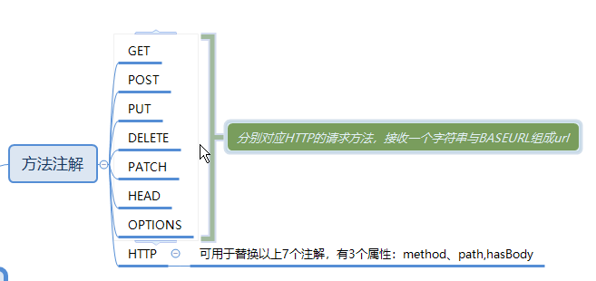
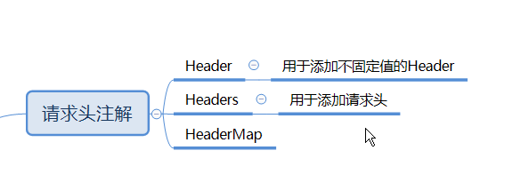

# Retrofit基本使用
--

[TOC]
<!--TOC-->

--
## 简介
[Retrofit文档](https://square.github.io/retrofit/)
[Retrofit Github地址](https://github.com/square/retrofit)

Retrofit 是一个 RESTful 的 HTTP 网络请求框架的封装，网络请求的工作本质上是 OkHttp 完成，而 Retrofit 仅负责 网络请求接口的封装。Retrofit是一款**基于注解**把http api转成接口，使用起来更加简单。

## Retrofit注解
Retrofit 共23个注解，这节就专门介绍这22个注解，为帮助大家更好理解我将这23个注解分为四大类。
### 方法注解
对应了HTTP标准中的请求方法，而HTTP注解则可以代替以上方法中的任意一个注解,有3个属性：method、path,hasBody


### 标记注解

### 请求头注解


### 参数注解

## 简单使用
### 引入Retrofit依赖及添加权限
```
    implementation 'com.squareup.retrofit2:retrofit:2.7.0'
    implementation 'com.squareup.retrofit2:converter-gson:2.7.0'

    <uses-permission android:name="android.permission.INTERNET"/>
    <uses-permission android:name="android.permission.WRITE_EXTERNAL_STORAGE"/>
    <uses-permission android:name="android.permission.READ_EXTERNAL_STORAGE"/>
```
### 创建Retrofit实例
在默认情况下Retrofit只支持将HTTP的响应体转换换为ResponseBody,而Converter就是Retrofit为我们提供用于将ResponseBody转换为我们想要的类型。

```
Retrofit retrofit = new Retrofit.Builder()
        .baseUrl("http://localhost:8080")
        //这里我们的数据格式是json，可以用Gson，也可以用Jackson
        .addConverterFactory(GsonConverterFactory.create())
        .build();
```
注：addConverterFactory是有先后顺序的，如果有多个ConverterFactory都支持同一种类型，那么就是只有第一个才会被使用

### 初步封装
如果我们每次使用，都要去创建Retrofit，那不是很麻烦吗？

所以我们可以把这些相关的配置，整合起来。把Retrofit的创建和配置定义成一个单例，这样子，我们要去发起请求的时候，直接使用单例获取就完事了。不用再重复去编写baseURL呀，转换器呀，连接时的相关属性，等等...
```

public class RetrofitManager {
    public static final String BASE_URL = "https://10.0.2.2:8888";
    public static final int CONNECT_TIME_OUT = 10000;//毫秒
    private Retrofit mRetrofit;

    private RetrofitManager() {
        createRetrofit();
    }

    private void createRetrofit() {
        //设置一下okHttp的参数
        OkHttpClient okHttpClient = new OkHttpClient.Builder()
                .connectTimeout(CONNECT_TIME_OUT, TimeUnit.MILLISECONDS)
                .build();
        mRetrofit = new Retrofit.Builder()
                .baseUrl(BASE_URL)//设置BaseUrl
                .client(okHttpClient)//设置请求的client
                .addConverterFactory(GsonConverterFactory.create())//设置转换器
                .build();
    }

    private static RetrofitManager retrofitManager = null;

    public static RetrofitManager getInstance() {
        if(retrofitManager == null) {
            synchronized(RetrofitManager.class) {
                if(retrofitManager == null) {
                    retrofitManager = new RetrofitManager();
                }
            }
        }
        return retrofitManager;
    }

    public Retrofit getRetrofit() {
        return mRetrofit;
    }

}

```

### 定义API接口
```
public interface IUserService {

    @GET
    Call<ResultModel> getUser(@Url String url);

    @GET("/users/{id}")
    Call<ResultModel> getUser(@Path("id")  int id);

    @GET("/users")      //  /user?phone=XXX&name=XXX
    Call<ResultModel> getUser(@Query("phone")  String phone,@Query("name")  String name );

    @GET("/users")      //  /user?phone=XXX&name=XXX
    Call<ResultModel> getUser(@QueryMap Map<String,Object> params);

    @POST("/users")
    Call<ResultModel> postUser(@Body User user);

    /************************* Part  PartMap ****************************/

    @Multipart
    @POST("/files")
    Call<ResultModel> postFile(@Part MultipartBody.Part part);

    @Multipart
    @POST("/files")
    Call<ResultModel> postFiles(@Part List<MultipartBody.Part> parts);

    /**
     * 上传多个文件
     * @param part
     * @param params
     * @return
     */
    @Multipart
    @POST("/files")
    Call<ResultModel> postFilesWithParams(@Part MultipartBody.Part part, @PartMap Map<String,String> params);

    /************************* Field  FieldMap ****************************/

    @POST("/users")
    Call<ResultModel> postUser(@Field("name") String name,@Field("phone")String phone);

    @POST("/users")
    Call<ResultModel> postUser(@FieldMap Map<String,Object> params);

    /************************* Header  Headers  HeaderMap ****************************/

    @POST("/users")
    Call<ResultModel> postUser(@Body User user,@Header("token")String token);

    @Headers({"token:sa56312as1d2","version:1"})
    @POST("/users")
    Call<ResultModel> postUser();

    @POST("/users")
    Call<ResultModel> postFile(@HeaderMap Map<String,String> headers);

}
```
### 创建代理对象
```
    IUserService userService = RetrofitManager.getInstance().getRetrofit().create(IUserService.class);
```
### 接口调用
```
        Call<ResultModel> call = userService.getUser(1);
        call.enqueue(new Callback<ResultModel>() {
            @Override
            public void onResponse(Call<ResultModel> call, Response<ResultModel> response) {
                Log.i(TAG,"response-->"+response.body());
            }

            @Override
            public void onFailure(Call<ResultModel> call, Throwable t) {
                Log.i(TAG,"onFailure-->"+t.getMessage());
            }
        });

        /************************文件上传******************/
        
        File file = new File("/storage/emulated/0/Download/1.jpg");
        MediaType mediaType = MediaType.parse("image/jpg");
        RequestBody fileBody = RequestBody.create(mediaType,file);
        MultipartBody.Part part = MultipartBody.Part.createFormData("file",file.getName(),fileBody);
        Call<ResultModel> task = userService.postFile(part);
        task.enqueue(new Callback<ResultModel>() {
            @Override
            public void onResponse(Call<ResultModel> call,Response<ResultModel> response) {
                Log.d(TAG,"onResponse -- > " + response.body());
            }

            @Override
            public void onFailure(Call<ResultModel> call,Throwable t) {
                Log.d(TAG,"onFailure -- > " + t.toString());
            }
        });
```